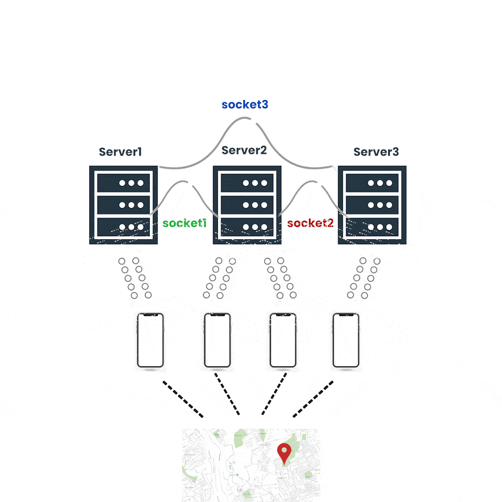

# Python Real-time Location Tracker
<h2> Project Overview</h2>
 
<p align="center">
  
</p>


Ce projet Python est une application serveur qui permet de suivre en temps réel la localisation des utilisateurs. Les utilisateurs envoient leurs données de localisation depuis des appareils clients, et le serveur affiche ces données sur une carte. L'application utilise Flask pour créer une API permettant aux clients d'envoyer et de recevoir des données de localisation.

## Caractéristiques principales

- **Suivi en temps réel** : Suivez la localisation des utilisateurs depuis des appareils clients en temps réel.
- **Communication via des sockets TCP** : Assurez une communication fiable entre le serveur et les clients.
- **Stockage des données de localisation Temporaire** : Stockez les données de localisation des utilisateurs avec horodatage pour une analyse ultérieure.
- **Optimisation de la performance** : Supprimez périodiquement les données anciennes pour garantir des performances optimales.
- **Prise en charge de plusieurs clients** : Gérez simultanément les données de plusieurs utilisateurs.

## Démarrage

### Prérequis

Avant de commencer, assurez-vous d'avoir installé [Python](https://www.python.org/) et les dépendances suivantes  dans un environnement Virtuel :

### Installation
1.VirtualEnviroment 

  ```sh
      pip install virtualenv
  ```
2.Python Envµ

  ```sh
     python -m venv <directory>
  ```
3. Requirments
    - Flask
    - Flask_Cors
    - Requests

4. Clonez le dépôt :
    ```sh
   git clone https://github.com/MohamedBenRhouma/Local-tracking-phones-fog-computing.git
    ```

5. Configurez les paramètres de reseaux et les ports.
6.Lancez l'application Serveur et aprés le code Flutter
    ```sh
          python app.py
    ```
   ## Contribuer

Toutes les contributions sont les bienvenues ! Si vous souhaitez contribuer au développement de ce projet, suivez ces étapes :

1. **Clonez le projet** :
    ```sh
      git clone https://github.com/MohamedBenRhouma/Local-tracking-phones-fog-computing.git
    ```

2-**Créez une nouvelle branche** pour votre travail :
    ```sh
          git checkout -b feature/NouvelleFonctionnalite
    ```
   
3. **Faites vos modifications** et assurez-vous de suivre les normes de codage du projet.
4. **Commitez vos modifications** avec un message descriptif :
   
    ```sh
    git commit -m 'Ajouter une nouvelle fonctionnalité'
    ```
   
6. **Poussez votre branche** vers le dépôt distant :
   
    ```sh
     git push origin feature/NouvelleFonctionnalite
    ```
   
8. **Ouvrez une demande de tirage** (Pull Request) sur GitHub. Assurez-vous de fournir une description détaillée de vos modifications.
9. Votre demande de tirage sera examinée, et une fois approuvée, elle sera fusionnée dans le projet.

Si vous avez des questions ou des idées à discuter, n'hésitez pas à ouvrir une nouvelle issue.

## Remerciements

Nous aimerions exprimer notre gratitude envers les personnes, projets et ressources qui ont inspiré et contribué à ce projet. Leur soutien a été précieux et a contribué à rendre ce projet possible.

Nous remercions tout particulièrement les personnes suivantes :

  &nbsp;&nbsp;&nbsp; -Mohamed Ali mnasser : https://github.com/mnsdali     &nbsp;     &nbsp;   &nbsp; &nbsp;&nbsp;&nbsp;&nbsp;&nbsp;                  -Amine Abid : https://github.com/Amine-ABID                                         &nbsp;        &nbsp;&nbsp;&nbsp;    -Assil Bouaziz : 

Votre soutien et vos contributions sont grandement appréciés.


  


